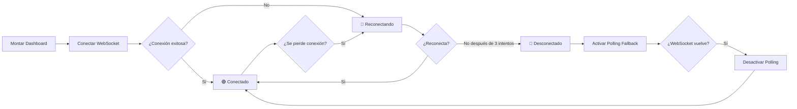

# 📚 Documentación Completa del Proyecto ReGPS

## ⚡ Inicio Rápido

Para iniciar el servidor de desarrollo localmente:

```bash
# Navegar al directorio del proyecto
cd c:\Users\Neff_PM\Documents\ChambitasUwU\ReGps\ReGps

# Terminal 1: Iniciar servidor WebSocket (Reverb)
php artisan reverb:start

# Terminal 2: Iniciar servidor Laravel
php artisan serve

# Terminal 3: Compilar assets en desarrollo (opcional)
npm run dev

# Acceder en el navegador:
# http://127.0.0.1:8000
```

**Nota:** 
- ⚠️ **Es OBLIGATORIO iniciar Reverb** (`php artisan reverb:start`) antes de usar la aplicación para que funcionen las actualizaciones en tiempo real.
- Asegúrate de tener todas las dependencias instaladas y el archivo `.env` configurado correctamente.
- Necesitarás 2 terminales simultáneas: una para Reverb (puerto 8080) y otra para Laravel (puerto 8000).

---

## 📊 Estado del Proyecto

**Fecha de actualización:** 27 de Noviembre, 2025  
**Estado:** En Desarrollo Activo  
**Completitud Backend:** ~85% (Módulos Core Completos)  
**Completitud Frontend:** ~90%

### Stack Tecnológico

| Componente | Tecnología | Estado |
|:-----------|:-----------|:-------|
| **Backend** | Laravel Framework 12.x | ✅ Configurado |
| **Frontend** | Vue 3 + Vite + TypeScript | ✅ Configurado |
| **Estilos** | TailwindCSS v4 + CSS Variables | ✅ Configurado |
| **Base de Datos** | SQLite (configurable a MySQL/PostgreSQL) | ✅ Configurado |
| **Autenticación** | Laravel Sanctum | ✅ Implementado |
| **Mapas** | Leaflet.js | ✅ Instalado |

### Módulos Implementados

#### Backend ✅
- ✅ **Autenticación:** Login, Logout, Perfil (Laravel Sanctum)
- ✅ **Usuarios:** CRUD completo con roles (Administrador/Empleado)
- ✅ **Empleados:** Gestión completa de empleados
- ✅ **Dispositivos:** CRUD completo con relación a empleados
- ✅ **Ubicaciones:** Registro, consulta y optimización con índices
- ✅ **Zonas:** Gestión de geocercas (Círculos y Polígonos)
- ✅ **Checkpoints:** Implementados como tipo de zona
- ✅ **Alertas:** Sistema automático con prioridades (Baja/Media/Alta/Crítica)
- ✅ **Historial de Zonas:** Registro de entrada/salida de dispositivos
- ✅ **Permisos y Roles:** Sistema de permisos basado en roles
- ✅ **WebSockets:** Laravel Reverb para actualizaciones en tiempo real

#### Frontend 🚧
- ✅ **Autenticación completa** con store Pinia
- ✅ **Navegación responsive** con menú hamburguesa móvil
- ✅ **Componentes UI profesionales** (Modal, Card, Button, Loading)
- ✅ **Footer** con enlaces y contacto
- ✅ **Vistas principales:** Dashboard, Usuarios, Dispositivos, Historial, Zonas, Alertas
- ✅ **Tema consistente:** Negro/Naranja con diseño moderno
- ✅ **Modales elegantes:** Sistema de modales centrados con animaciones suaves
- ✅ **Gestión de Dispositivos:** Interfaz completa con acciones (Ver ubicación, Editar, Eliminar)
- ✅ **Gestión de Usuarios:** CRUD completo con roles y estados
- ✅ **Gestión de Zonas:** Crear/Editar zonas con mapa interactivo de Leaflet
- ✅ **Integración de mapas:** Leaflet.js funcionando correctamente
- ⏳ **Rastreo GPS en tiempo real**

### Módulos Pendientes

**Backend:**
- ❌ **Vehículos:** Tabla `vehicles` (Modelo, Controlador y Migración)
- ❌ **Viajes/Rutas:** Tabla `trips` para gestión de trayectos planificados
- ❌ **Empresas:** Tabla `companies` para multi-tenancy (múltiples clientes)
- ❌ **Notificaciones:** Sistema de notificaciones push en tiempo real
- ❌ **Reportes Programados:** Generación automática de reportes PDF/Excel
- ❌ **Mantenimiento:** Tabla `device_maintenances` para registro de servicios
- ❌ **Tipos de Dispositivo:** Tabla `device_types` para categorización
- ❌ **Combustible:** Tabla `fuel_records` para monitoreo de consumo

**Frontend:**
- ⏳ Exportación de reportes PDF/Excel
- ✅ **WebSockets para actualizaciones en tiempo real** (Laravel Reverb + Echo)
- ⏳ Notificaciones push del navegador
- ✅ **Vista de Dashboard con mapas en tiempo real**

---

## 🎨 Mejoras Recientes de UI/UX (Nov 26, 2025)

### Sistema de Modales Mejorado
- **Diseño consistente:** Todos los modales (Dispositivos, Usuarios, Zonas) con el mismo estilo elegante
- **Colores del tema:** Fondo negro puro (#000000) con bordes naranjas (#FF6B35)
- **Animaciones suaves:** Entrada con escala y desplazamiento
- **Centrado perfecto:** Modales siempre centrados en la pantalla con `position: fixed`
- **Backdrop oscuro:** Fondo con desenfoque (`backdrop-filter: blur(8px)`)
- **Iconos contextuales:** Íconos naranjas en labels y headers dinámicos

### Vista de Dispositivos
- **Botones de acción mejorados:**
  - 📍 Ver Ubicación (naranja) - Redirige al dashboard
  - ✏️ Editar (azul) - Modal elegante
  - 🗑️ Eliminar (rojo)
- **Modal de edición:** Sistema de modal centrado reemplazando la expansión inline

### Vista de Usuarios
- **CRUD completo:** Crear, leer, actualizar y eliminar usuarios
- **Gestión de roles:** Administrador y Empleado con emojis (👑 👤)
- **Estados visuales:** Activo ✅ / Inactivo ⛔
- **Modal modernizado:** Mismo estilo que dispositivos

### Vista de Zonas (Geofencing)
- **Mapa interactivo:** Leaflet.js integrado correctamente con iconos personalizados
- **Creación de zonas:**
  - Círculos: Click para colocar centro, definir radio
  - Polígonos: Click para agregar puntos, doble-click para finalizar
- **Edición de zonas:** Carga y muestra zonas existentes en el mapa
- **Estilos de mapa:** Tema oscuro consistente con filtros de brillo
- **Instrucciones contextuales:** Guías según el tipo de geometría seleccionada
- **Checkpoints permanentes:** Opción para crear checkpoints 24/7 sin horarios
- **Marcadores únicos:** Sistema mejorado que evita duplicación de marcadores
- **Botones mejorados:** Botones con gradientes, íconos y animaciones profesionales
- **Manejo de errores:** Mensajes de error detallados del backend

### Paleta de Colores Consistente
```css
- Primario: #FF6B35 (Naranja)
- Secundario: #FF8C5E (Naranja claro)
- Fondo: #000000 (Negro puro)
- Fondo alternativo: #0f1419 (Negro suave)
- Texto: #ffffff (Blanco)
- Texto secundario: #9ca3af (Gris)
- Bordes: rgba(255, 107, 53, 0.3) (Naranja transparente)
```

---

## 🔌 Sistema de WebSockets para Tiempo Real (Nov 26, 2025)

### Implementación Completa

#### Backend - Laravel Reverb + Pusher
- **Laravel Reverb 1.6.2:** Servidor WebSocket nativo de Laravel instalado
- **Pusher PHP Server 7.2.7:** Cliente PHP para broadcasting
- **Event Broadcasting:** Sistema de eventos con `ShouldBroadcast`

##### Evento de Ubicación Actualizada
Archivo: `app/Events/UbicacionActualizada.php`
```php
class UbicacionActualizada implements ShouldBroadcast
{
    public function broadcastOn(): Channel
    {
        return new Channel('ubicaciones');
    }
    
    public function broadcastWith(): array
    {
        return [
            'UbicacionID' => $this->ubicacion->UbicacionID,
            'DispositivoID' => $this->ubicacion->DispositivoID,
            'Latitud' => $this->ubicacion->Latitud,
            'Longitud' => $this->ubicacion->Longitud,
            'FechaHora' => $this->ubicacion->FechaHora,
            'dispositivo' => $this->ubicacion->dispositivo,
            'empleado' => $this->ubicacion->dispositivo?->empleado,
        ];
    }
}
```

##### Broadcast desde Controlador
Archivo: `app/Http/Controllers/Api/UbicacionController.php`
```php
public function store(Request $request)
{
    // ... validación y creación ...
    
    // Broadcast en tiempo real
    broadcast(new UbicacionActualizada($ubicacion))->toOthers();
    
    return response()->json($ubicacion->load('dispositivo.empleado'), 201);
}
```

#### Frontend - Laravel Echo + Vue Composable

##### Composable de Rastreo en Tiempo Real
Archivo: `resources/js/composables/useRealTimeTracking.ts`

**Características:**
- 🔌 Conexión/desconexión automática a WebSocket
- 📡 Suscripción al canal `ubicaciones`
- 💾 Almacenamiento en Map para eficiencia
- ✅ Estado de conexión reactivo
- 🔄 Manejo de actualizaciones incrementales

**API del Composable:**
```typescript
const {
  conectar,          // Conectar a WebSocket
  desconectar,       // Desconectar
  lastUpdate,        // Ref con última actualización
  isConnected,       // Ref booleano de estado
  getUbicacion,      // Obtener ubicación por dispositivo
  getAllUbicaciones  // Obtener todas las ubicaciones
} = useRealTimeTracking()
```

##### Integración en Dashboard
Archivo: `resources/js/views/Dashboard.vue`

**Funcionalidades implementadas:**
1. **Conexión automática:** Se conecta al montar el componente
2. **Desconexión limpia:** Se desconecta al desmontar
3. **Actualización de marcadores:** Watch en `lastUpdate` actualiza el mapa
4. **Indicador visual:** Badge de estado de conexión (🟢/🔴)
5. **Actualización incremental:** Solo actualiza el dispositivo modificado
6. **Fallback polling:** Mantiene polling cada 30s como respaldo

**Indicador de Estado:**
```vue
<div class="flex items-center gap-2 px-4 py-2 rounded-lg" 
     :class="isConnected ? 'bg-green-900/30 border border-green-500/30' : 'bg-red-900/30 border border-red-500/30'">
  <div class="w-2 h-2 rounded-full animate-pulse" 
       :class="isConnected ? 'bg-green-500' : 'bg-red-500'"></div>
  <span class="text-sm font-medium" :class="isConnected ? 'text-green-400' : 'text-red-400'">
    {{ isConnected ? '🟢 Conectado' : '🔴 Desconectado' }}
  </span>
</div>
```

### Uso en Producción

#### Iniciar Servidores (Desarrollo)
```bash
# Terminal 1: Servidor WebSocket Reverb (OBLIGATORIO)
cd C:\Users\Neff_PM\Documents\ChambitasUwU\ReGps\ReGps
php artisan reverb:start

# Terminal 2: Aplicación Laravel
cd C:\Users\Neff_PM\Documents\ChambitasUwU\ReGps\ReGps
php artisan serve

# Terminal 3: Frontend en modo desarrollo (OPCIONAL - solo para desarrollo)
cd C:\Users\Neff_PM\Documents\ChambitasUwU\ReGps\ReGps
npm run dev
```

**⚠️ IMPORTANTE:**
- **Reverb DEBE estar corriendo** para que funcionen las actualizaciones en tiempo real
- Si ves error 500 al enviar ubicaciones, verifica que Reverb esté activo en el puerto 8080
- En producción, usa `pm2` o `supervisor` para mantener Reverb corriendo como servicio

#### Configuración .env
```env
BROADCAST_CONNECTION=reverb

REVERB_APP_ID=your-app-id
REVERB_APP_KEY=your-app-key
REVERB_APP_SECRET=your-app-secret
REVERB_HOST="0.0.0.0"
REVERB_PORT=8080
REVERB_SCHEME=http

VITE_REVERB_APP_KEY="${REVERB_APP_KEY}"
VITE_REVERB_HOST="${REVERB_HOST}"
VITE_REVERB_PORT="${REVERB_PORT}"
VITE_REVERB_SCHEME="${REVERB_SCHEME}"
```

### Ventajas del Sistema
- ⚡ **Latencia ultra-baja:** Actualizaciones instantáneas sin polling
- 🔋 **Eficiencia:** Reduce carga del servidor eliminando peticiones constantes
- 📊 **Escalabilidad:** Reverb maneja miles de conexiones simultáneas
- 🛡️ **Confiabilidad:** Sistema de fallback con polling cada 30s
- 🎨 **UX mejorada:** Indicador visual de estado de conexión
- 🔄 **Actualizaciones incrementales:** Solo actualiza dispositivos modificados

### Sistema de Reconexión Inteligente

#### **Indicador Visual Mejorado (3 Estados)**

El Dashboard muestra en tiempo real el estado de la conexión WebSocket:

| Estado | Indicador | Significado | Color |
|--------|-----------|-------------|-------|
| **🟢 Conectado en vivo** | Punto verde pulsante | WebSocket activo, recibiendo actualizaciones en tiempo real | Verde |
| **🔄 Reconectando...** | Punto amarillo girando | Intentando restablecer conexión | Amarillo |
| **🔴 Sin conexión en tiempo real** | Punto rojo estático | WebSocket desconectado, usando polling fallback | Rojo |

#### **Reconexión Automática**

Laravel Echo maneja la reconexión automáticamente cuando se pierde la conexión:

```typescript
// Eventos de conexión detectados automáticamente
window.Echo.connector.pusher.connection.bind('connected', () => {
  // ✅ Conexión establecida
  isReconnecting.value = false
})

window.Echo.connector.pusher.connection.bind('connecting', () => {
  // 🔄 Intentando reconectar
  isReconnecting.value = true
})

window.Echo.connector.pusher.connection.bind('disconnected', () => {
  // 🔴 Desconectado
  isReconnecting.value = false
})
```

**Comportamiento de reconexión:**
- ⏱️ Primer intento: Inmediato
- ⏱️ Reintentos (1-5): Cada 1 segundo
- ⏱️ Reintentos (6-10): Cada 2 segundos
- ⏱️ Reintentos (11+): Cada 5 segundos
- ♾️ Continúa indefinidamente hasta reconectar

#### **Fallback a Polling Inteligente**

Si WebSocket no se puede reconectar, el sistema activa automáticamente un polling de respaldo:

```typescript
// Detectar desconexión y activar fallback
watch(isConnected, (connected) => {
  if (!connected && !pollingInterval) {
    console.warn('⚠️ WebSocket desconectado, activando polling cada 15 segundos')
    
    // Activar polling como respaldo
    pollingInterval = setInterval(async () => {
      await refreshLocations()
    }, 15000)
    
  } else if (connected && pollingInterval) {
    console.log('✅ WebSocket restaurado, desactivando polling fallback')
    clearInterval(pollingInterval)
    pollingInterval = null
  }
})
```

**Características del fallback:**
- ⏰ Se activa automáticamente al perder conexión WebSocket
- 🔄 Polling cada 15 segundos (más lento que WebSocket pero funcional)
- 🎯 Se desactiva automáticamente cuando WebSocket se restaura
- 💾 Garantiza que el Dashboard siempre reciba actualizaciones

#### **Ciclo de Vida de la Conexión**



#### **Escenarios Comunes**

##### 1. **Internet Lento o Intermitente**
```
🟢 Conectado → 🔄 Reconectando → 🟢 Conectado
```
- Echo reintenta automáticamente
- Usuario ve feedback visual del estado
- Se reconecta sin intervención manual

##### 2. **Reverb Caído**
```
🟢 Conectado → 🔄 Reconectando → 🔴 Desconectado → Polling activado
```
- Después de varios intentos fallidos
- Polling cada 15 segundos como respaldo
- Dashboard sigue funcionando (más lento)

##### 3. **Usuario Sale de Túnel (sin señal)**
```
🔴 Desconectado (con polling) → 🔄 Reconectando → 🟢 Conectado
```
- Echo detecta que internet volvió
- Reconecta automáticamente
- Polling se desactiva automáticamente

#### **Logs de Consola**

Puedes monitorear el estado en la consola del navegador (F12):

```javascript
// Conexión exitosa
✅ WebSocket conectado

// Desconexión
🔴 WebSocket desconectado
⚠️ WebSocket desconectado, activando polling cada 15 segundos

// Reconexión
🔄 Intentando reconectar...

// Restauración
✅ WebSocket conectado
✅ WebSocket restaurado, desactivando polling fallback
```

#### **Ventajas del Sistema de Reconexión**

- 🔄 **Automático:** Cero intervención manual
- 🎯 **Inteligente:** Polling solo cuando es necesario
- 👁️ **Transparente:** Usuario siempre sabe el estado
- 🛡️ **Robusto:** Nunca pierde funcionalidad completamente
- 💰 **Eficiente:** No hace polling innecesario cuando WebSocket funciona
- 📱 **Mobile-friendly:** Maneja bien conexiones inestables

#### **Troubleshooting**

| Problema | Causa | Solución |
|----------|-------|----------|
| 🔴 Siempre desconectado | Reverb no está corriendo | `php artisan reverb:start` |
| 🔄 Reconectando infinito | Puerto 8080 bloqueado | Verificar firewall |
| Polling activado siempre | Mismatch de configuración | Verificar `.env` y `app.ts` |
| No actualiza el mapa | Ambos: WebSocket y API caídos | Verificar backend Laravel |

**Verificación rápida:**
```bash
# ¿Reverb está corriendo?
netstat -an | findstr :8080

# ¿Laravel está corriendo?
curl http://127.0.0.1:8000/api/locations/current
```


---

# 📚 Documentación Completa del Proyecto ReGPS

> **Sistema de Rastreo GPS en Tiempo Real con Geofencing Inteligente**

## 🔍 Descripción General
ReGPS es una solución integral para el monitoreo y gestión de flotas vehiculares, ofreciendo seguimiento en tiempo real, geofencing inteligente y análisis avanzado de rutas. Diseñado para empresas que necesitan optimizar sus operaciones logísticas y garantizar la seguridad de sus activos móviles.

### Características Principales
- Monitoreo en tiempo real de múltiples vehículos
- Alertas automáticas por exceso de velocidad
- Geofencing con zonas personalizables
- Reportes detallados de rutas y tiempos
- Análisis de comportamiento del conductor
- Integración con servicios de mapas
- API RESTful para integraciones

### Casos de Uso
1. **Gestión de Flotas**
   - Monitoreo de vehículos en tiempo real
   - Optimización de rutas
   - Control de combustible

2. **Seguridad**
   - Alertas de geocercas
   - Detección de uso no autorizado
   - Historial de ubicaciones

3. **Mantenimiento**
   - Recordatorios de servicio
   - Monitoreo del estado del vehículo
   - Historial de mantenimiento

## 📌 Tabla de Contenidos
1. [Visión General](#-visión-general)
2. [Estructura del Proyecto](#-estructura-del-proyecto)
3. [Flujo de Datos](#-flujo-de-datos)
4. [Funcionalidades Clave](#-funcionalidades-clave)
5. [Guía de Implementación de ML](#-guía-de-implementación-de-machine-learning)
6. [Configuración del Entorno](#-configuración-del-entorno)
7. [API y Endpoints](#-api-y-endpoints)
8. [Soporte y Mantenimiento](#-soporte-y-mantenimiento)

## 🌟 Visión General
ReGPS es un sistema profesional de rastreo GPS en tiempo real desarrollado con:
- **Backend**: Laravel 12 (PHP 8.4+)
- **Frontend**: Vue.js 3 con TypeScript
- **Base de Datos**: MySQL/PostgreSQL/SQLite
- **Machine Learning**: Python 3.9+

## 🚀 Instalación y Configuración

### Requisitos del Sistema
- **Servidor Web**: Apache/Nginx
- **PHP**: 8.2 o superior
- **Base de Datos**: MySQL 5.7+/PostgreSQL/SQLite
- **Node.js**: 18.x LTS o superior
- **Composer**: Última versión estable

### Instalación Paso a Paso

1. **Clonar el Repositorio**
   ```bash
   git clone https://github.com/tu-usuario/ReGps.git
   cd ReGps/ReGps
   ```

2. **Instalar Dependencias PHP**
   ```bash
   composer install --no-dev --optimize-autoloader
   ```

3. **Instalar Dependencias de Frontend**
   ```bash
   npm install
   npm run build
   ```

4. **Configurar Variables de Entorno**
   ```bash
   cp .env.example .env
   php artisan key:generate
   ```
   
   Editar el archivo `.env` con la configuración de la base de datos y servicios externos.

5. **Configurar Base de Datos**
   ```bash
   # Para SQLite
   touch database/database.sqlite
   
   # Para MySQL/PostgreSQL
   # Crear la base de datos manualmente
   
   # Ejecutar migraciones y seeders
   php artisan migrate --seed
   ```

6. **Configurar Storage**
   ```bash
   php artisan storage:link
   ```

7. **Configurar Tareas Programadas**
   ```bash
   # En producción, agregar al cron:
   * * * * * cd /ruta/al/proyecto && php artisan schedule:run >> /dev/null 2>&1
   ```

### Comandos Útiles

| Comando | Descripción |
|---------|-------------|
| `php artisan reverb:start` | **REQUERIDO:** Iniciar servidor WebSocket (puerto 8080) |
| `php artisan serve` | Iniciar servidor de desarrollo (puerto 8000) |
| `npm run dev` | Compilar assets en desarrollo con hot-reload |
| `npm run build` | Compilar assets para producción |
| `php artisan queue:work` | Procesar colas |
| `php artisan schedule:run` | Ejecutar tareas programadas |
| `php artisan optimize` | Optimizar la aplicación |
| `php artisan migrate:fresh --seed` | Recrear base de datos con datos de prueba |

## 🏗️ Estructura del Proyecto

### Directorios Principales
```
ReGps/
├── app/                 # Lógica principal de Laravel
├── config/             # Archivos de configuración
├── database/           # Migraciones y seeders
├── public/             # Archivos públicos
├── resources/          # Vistas y assets
├── routes/             # Rutas de la API y web
├── tests/              # Pruebas automatizadas
├── ml/                 # Módulo de Machine Learning
│   ├── data/           # Datos crudos y procesados
│   ├── models/         # Modelos entrenados
│   ├── notebooks/      # Análisis exploratorio
│   └── scripts/        # Scripts de procesamiento
└── storage/            # Archivos subidos y caché
```

## 🔄 Flujo de Datos

### 1. Recepción de Ubicaciones
- **Endpoint**: `POST /api/ubicaciones`
- **Frecuencia**: 5-30 segundos por dispositivo
- **Validaciones**:
  - Coordenadas válidas
  - Velocidad realista
  - Timestamp preciso

### 2. Procesamiento en Tiempo Real
- Optimización de señales GPS
- Detección de movimiento
- Cálculo de métricas

### 3. Almacenamiento
- Base de datos relacional para datos estructurados
- Almacenamiento en caché para datos en tiempo real
- Archivos planos para respaldos

## 🎯 Funcionalidades Clave

### 1. Monitoreo en Tiempo Real
- Seguimiento de múltiples dispositivos
- Actualizaciones cada 5-30 segundos
- Visualización en mapa interactivo

### 2. Geofencing
- Creación de zonas geográficas
- Alertas de entrada/salida
- Tiempos de permanencia

### 3. Reportes
- Historial de rutas
- Tiempos de conducción
- Comportamiento del conductor
- Eficiencia de rutas

## 🤖 Guía de Implementación de Machine Learning

### 1. Requisitos Previos
- Python 3.9+
- Gestor de paquetes (pip/conda)
- Acceso a la base de datos

### 2. Instalación
```bash
# Clonar repositorio
git clone [url-del-repositorio]
cd ReGps/ReGps

# Crear entorno virtual (Windows)
python -m venv venv
.\venv\Scripts\activate

# Instalar dependencias
pip install -r ml/requirements.txt
```

### 3. Modelos Implementados

#### Clasificación de Comportamiento
- **Objetivo**: Identificar patrones de conducción
- **Características**:
  - Aceleración/desaceleración
  - Velocidades máximas
  - Horarios de conducción

#### Predicción de Mantenimiento
- **Objetivo**: Predecir fallos en dispositivos
- **Señales**:
  - Inconsistencias en GPS
  - Patrones de vibración
  - Historial de mantenimiento

### 4. API de Predicciones
```python
# Ejemplo de solicitud
POST /ml-api/predict
{
    "device_id": "DEV123",
    "locations": [
        {"lat": 19.4326, "lng": -99.1332, "speed": 45, "timestamp": "..."},
        ...
    ]
}
```

## ⚙️ Configuración del Entorno

### Variables de Entorno (.env)
```ini
DB_CONNECTION=mysql
DB_HOST=127.0.0.1
DB_PORT=3306
DB_DATABASE=ReGps
DB_USERNAME=usuario
DB_PASSWORD=1234

ML_MODEL_PATH=ml/models/behavior_classifier.joblib
```

### Configuración del Servidor
```

### 1. Autenticación

#### Iniciar Sesión
```http
POST /api/login
Content-Type: application/json

{
    "email": "usuario@ejemplo.com",
    "password": "contraseña"
}
```

Respuesta exitosa:
```json
{
    "token": "1|abcdef123456...",
    "user": {
        "id": 1,
        "name": "Nombre Usuario",
        "email": "usuario@ejemplo.com"
    }
}
```

### 2. Dispositivos

#### Listar Dispositivos
```http
GET /api/dispositivos
```

#### Registrar Nuevo Dispositivo
```http
POST /api/dispositivos
Content-Type: application/json

{
    "imei": "123456789012345",
    "modelo": "GPS-2023",
    "marca": "TrackTech",
    "empleado_id": 1
}
```

### 3. Ubicaciones

#### Enviar Ubicación
```http
POST /api/ubicaciones
Content-Type: application/json

{
    "dispositivo_id": 1,
    "latitud": 19.4326,
    "longitud": -99.1332,
    "velocidad": 45.5,
    "direccion": "Norte",
    "precision": 5.2,
    "timestamp": "2025-11-20 12:00:00"
}
```

#### Obtener Historial de Ubicaciones
```http
GET /api/ubicaciones?dispositivo_id=1&fecha_inicio=2025-11-20&fecha_fin=2025-11-21
```

### 4. Geocercas

#### Listar Geocercas
```http
GET /api/geocercas
```

#### Crear Geocerca
```http
POST /api/geocercas
Content-Type: application/json

{
    "nombre": "Oficina Principal",
    "tipo": "poligono",
    "coordenadas": [
        [19.4326, -99.1332],
        [19.4330, -99.1340],
        [19.4315, -99.1345]
    ],
    "radio": null,
    "color": "#FF0000"
}
```

### 5. Reportes

#### Generar Reporte de Ruta
```http
POST /api/reportes/ruta
Content-Type: application/json

{
    "dispositivo_id": 1,
    "fecha_inicio": "2025-11-20 00:00:00",
    "fecha_fin": "2025-11-20 23:59:59",
    "tipo": "pdf"
}
```

### Códigos de Estado HTTP
- `200 OK` - Petición exitosa
- `201 Created` - Recurso creado
- `400 Bad Request` - Error en la petición
- `401 Unauthorized` - No autenticado
- `403 Forbidden` - No autorizado
- `404 Not Found` - Recurso no encontrado
- `422 Unprocessable Entity` - Error de validación
- `500 Internal Server Error` - Error del servidor

### Dispositivos
- `GET /api/dispositivos` - Listar dispositivos
- `POST /api/dispositivos` - Crear dispositivo
- `GET /api/dispositivos/{id}` - Ver detalles

### Ubicaciones
- `POST /api/ubicaciones` - Registrar ubicación
- `GET /api/ubicaciones?device_id=X` - Historial
### Mantenimiento Programado
- Respaldo diario de base de datos
- Actualización de modelos ML
- Limpieza de datos antiguos

### Soporte Técnico
- Documentación actualizada
- Foro de la comunidad
- Soporte por correo electrónico

---
*Última actualización: 27 de Noviembre de 2025*
